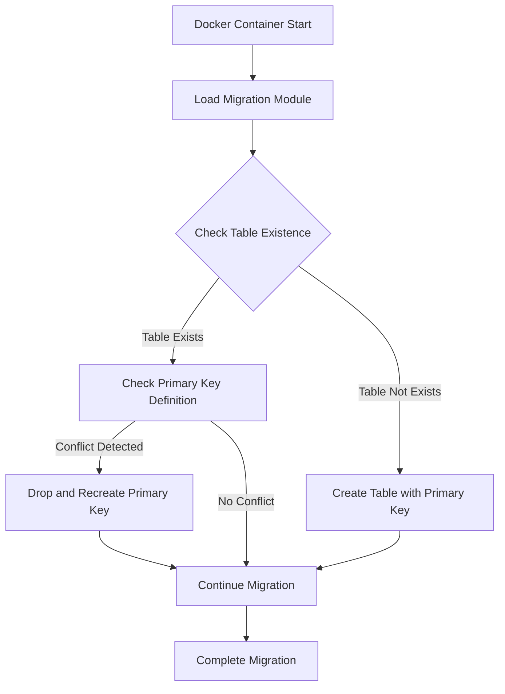

## Product Overview

修复 Docker 部署时的数据库迁移错误，解决主键重复定义和表不存在的问题。

## Core Features

- 修复 Error 1068: Multiple primary key defined 错误
- 修复 Error 1146: Table 'ykt_db.applications' doesn't exist 错误
- 添加表存在性检查机制
- 实现健壮的数据库迁移处理逻辑

## Tech Stack

- Backend: Go with GORM
- Database: MySQL
- Deployment: Docker

## Architecture Design

### System Architecture

当前项目使用 GORM 的 AutoMigrate 进行数据库迁移。需要改进迁移逻辑以处理：

1. 已存在表的重复主键定义问题
2. 表不存在时的初始化问题

### Module Division

- **Migration Module**: 负责数据库迁移逻辑
- 表存在性检查
- 主键冲突检测
- 增量迁移处理
- 依赖: Database Connection Module

- **Database Connection Module**: 数据库连接管理
- GORM 连接池配置
- 连接健康检查
- 依赖: Config Module

### Data Flow



## Implementation Details

### Core Directory Structure

```
did-login-backend/
├── db/
│   ├── migrations/
│   │   └── migration.go          # Modified: 改进迁移逻辑
│   ├── models/
│   │   └── application.go        # Modified: 检查主键定义
│   └── db.go                     # Modified: 添加表存在性检查
├── docker/
│   └── Dockerfile                # Modified: 优化迁移执行顺序
└── main.go                       # Modified: 添加迁移错误处理
```

### Key Code Structures

**Migration Interface**: 定义迁移操作接口

```
type Migration interface {
    CheckTableExistence(tableName string) (bool, error)
    CheckPrimaryKeyConflict(tableName string, keyName string) (bool, error)
    SafeAutoMigrate(models ...interface{}) error
}
```

**Robust Migration Logic**: 实现健壮的迁移处理

```
func SafeAutoMigrate(db *gorm.DB, models ...interface{}) error {
    for _, model := range models {
        tableName := db.NamingStrategy.TableName(reflect.TypeOf(model).String())
        
        exists, err := checkTableExists(db, tableName)
        if err != nil {
            return fmt.Errorf("failed to check table existence: %w", err)
        }
        
        if exists {
            if err := handlePrimaryKeyMigration(db, model); err != nil {
                return fmt.Errorf("failed to handle primary key migration: %w", err)
            }
        }
        
        if err := db.AutoMigrate(model); err != nil {
            return fmt.Errorf("failed to migrate %s: %w", tableName, err)
        }
    }
    return nil
}
```

### Technical Implementation Plan

**Problem Statement**: GORM AutoMigrate 在已存在表上重复执行时可能导致主键重复定义错误，且缺乏对表不存在的优雅处理。

**Solution Approach**:

1. 在迁移前添加表存在性检查
2. 对主键定义进行冲突检测和修复
3. 实现自定义迁移逻辑替代原生 AutoMigrate
4. 添加详细的错误处理和日志记录

**Key Technologies**:

- GORM v2
- MySQL driver
- Docker multi-stage builds

**Implementation Steps**:

1. 创建表存在性检查函数
2. 实现主键冲突检测和修复逻辑
3. 封装 SafeAutoMigrate 方法
4. 在 Docker 启动脚本中添加迁移重试机制
5. 添加迁移日志和监控

**Testing Strategy**:

- 单元测试：模拟各种数据库状态
- 集成测试：在 Docker 环境中测试完整迁移流程
- 回滚测试：验证迁移失败时的数据一致性